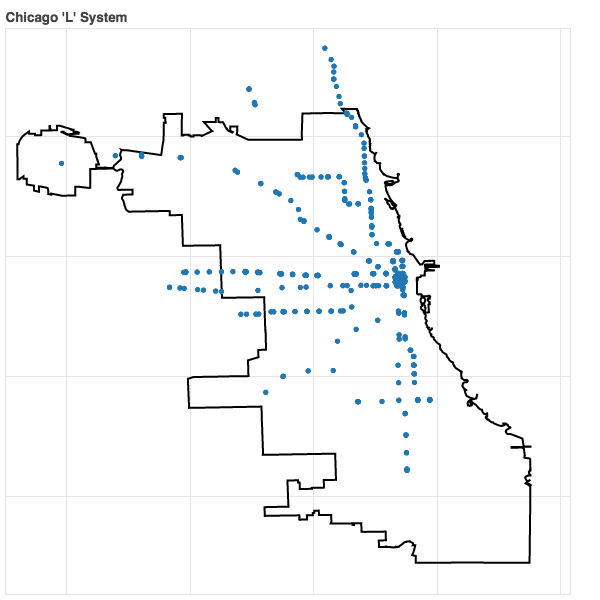

# A Quick Intro To Interactive Visualizations With Bokeh

## Introduction
The purpose of this blog post is to go over some of the basics of plotting with Bokeh. Bokeh is a Python library that generates interactive visualizations with ease and also can handle very large or streaming datasets. This is important because Matplotlib and Seaborn will often fail if the datasets one is working with becomes too large.

We will be using geospatial data with the end goal of making an interactive plot of the Chicago "L" stations. Therefore we will also make use of the GeoPandas library which extends the power of Pandas to geospatial data analysis.  A static image of the final results are shown below,

## Requirements
1. <a href="https://www.python.org/"> Python</a> (2.7)
2. <a href="http://jupyter.org/">Jupyter Notebook</a>
3. <a href="http://matplotlib.org/">Matplotlib</a>
4. <a href="http://geopandas.org/">GeoPandas</a>
5. <a href="http://bokeh.pydata.org/en/latest/">Bokeh</a>